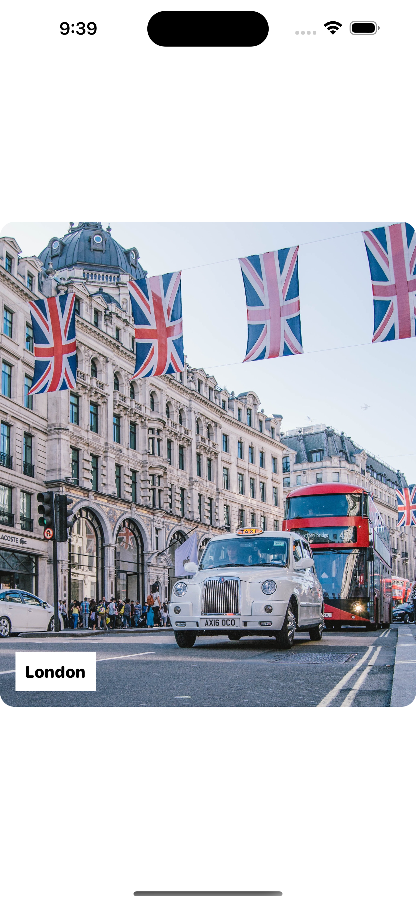

### **Problem ze ScrollView**

Chcielibyśmy zaimplementować karuzelę w SwiftUI. Na pierwszy rzut oka, można by chcieć stworzyć karuzelę, używając widoku ScrollView. 

W naszym przypadku, możemy założyć, że mamy do dyspozycji następujące pliki:

- `Assets.xcassets`: Tutaj znajdują się wymagane obrazy w katalogu zasobów.
- `ContentView.swift`: Plik zawiera domyślny widok SwiftUI wygenerowany przez Xcode.
- `Trip.swift`: Plik zawiera strukturę `Trip`, reprezentującą cel podróży w aplikacji. W celach testowych plik tworzy również tablicę `sampleTrips`, która zawiera przykładowe dane. Możesz modyfikować jej zawartość.
- `TripCardView.swift`: Plik implementuje interfejs użytkownika widoku karty. Każdy widok karty jest zaprojektowany do wyświetlania obrazu miejsca docelowego. Wiązanie `isShowDetails` kontroluje wygląd etykiety tekstowej. Gdy `isShowDetails` jest ustawione na `true`, etykieta będzie ukryta.

Poniżej znajduje się fragment kodu, który pokazuje, jak mogłaby wyglądać implementacja karuzeli przy użyciu widoku ScrollView w pliku `ContentView.swift`:

```swift
struct ContentView: View {

    @State private var isCardTapped = false

    var body: some View {
        GeometryReader { outerView in
            ScrollView(.horizontal, showsIndicators: false) {
                HStack(alignment: .center) {
                    ForEach(sampleTrips.indices, id: \.self) { index in
                        GeometryReader { innerView in
                            TripCardView(destination: sampleTrips[index].destination, imageName: sampleTrips[index].image, isShowDetails: self.$isCardTapped)
                        }
                        .padding(.horizontal, 20)
                        .frame(width: outerView.size.width, height: 450)
                    }
                }
            }
            .frame(width: outerView.size.width, height: outerView.size.height, alignment: .leading)
        }
    }
}
```

W powyższym kodzie osadziliśmy `HStack` w poziomym `ScrollView`, aby stworzyć suwak obrazów. W `HStack` iterujemy przez tablicę `sampleTrips` i tworzymy dla każdej podróży widok `TripCardView`. Aby lepiej kontrolować rozmiar karty, używamy dwóch `GeometryReader`ów: `outerView` i `innerView`, gdzie widok zewnętrzny reprezentuje rozmiar ekranu urządzenia, a widok wewnętrzny obejmuje widok karty w celu kontrolowania jej rozmiaru.

To wydaje się dość proste, prawda? Jeśli uruchomisz ten kod w podglądzie, powinien wyświetlić widok poziomego przewijania. Możesz przesuwać ekran, aby przewijać wszystkie widoki kart.


Czyli, czy uważasz, że zakończyliśmy tworzenie karuzeli? Jeszcze nie. Są jeszcze kilka większych problemów:

1. Obecna implementacja nie obsługuje stronowania. Innymi słowy, można przesuwać ekran, aby ciągle przewijać treść. Widok przewijania może zatrzymać się w dowolnym miejscu. Na przykład, spójrz na rysunek 4. Przewijanie zatrzymuje się między dwoma widokami kart. To nie jest zachowanie, które chcemy. Oczekujemy, że przewijanie zatrzyma się na granicach stron treści widoku.

2. Kiedy kartę zostanie naciśnięta, musimy znaleźć jej indeks i wyświetlić jej szczegóły w osobnym widoku. Problem polega na tym, że z obecną implementacją nie jest łatwo ustalić, którą kartę naciśnął użytkownik.

Oba te problemy są związane z wbudowanym widokiem ScrollView. Wersja UIKit przewijania obsługuje stronowanie. Jednak Apple nie wprowadził tej funkcji do frameworku SwiftUI. Aby rozwiązać ten problem, musimy zbudować nasze własne poziome przewijanie ze wsparciem dla stronowania.

Na pierwszy rzut oka może się wydawać, że trudno jest stworzyć własne przewijanie. Ale w rzeczywistości nie jest to aż tak trudne. Jeśli rozumiesz, jak używać HStack i DragGesture, możesz stworzyć poziome przewijanie ze wsparciem dla stronowania.

### Tworzenie Karuzeli przy użyciu HStack i DragGesture

Idea polega na układaniu wszystkich widoków kart (czyli podróży) w poziomy stos (HStack). HStack powinien być wystarczająco długi, aby pomieścić wszystkie widoki kart, ale jednocześnie wyświetlać tylko jeden widok karty w danym momencie. Domyślnie poziomy stos nie obsługuje przewijania. Dlatego musimy dołączyć rozpoznawanie gestów przeciągania do stosu i obsłużyć przeciąganie sami. Poniższa figura ilustruje naszą implementację poziomego przewijania.


#### Implementacja poziomego stosu

Teraz zobaczmy, jak zamienić tę ideę na kod. Proszę wyrozumiałeś mnie, że będziesz musiał kilkakrotnie aktualizować kod. Chcę Ci krok po kroku pokazać implementację. Otwórz plik Content.swift i zaktualizuj zawartość `body` w ten sposób:

```swift
var body: some View {
    HStack {
        ForEach(sampleTrips.indices, id: \.self) { index in
            TripCardView(destination: sampleTrips[index].destination, imageName: sampleTrips[index].image, isShowDetails: self.$isCardTapped)
        }
    }
}
```

W powyższym kodzie zaczynamy od rozmieszczenia wszystkich widoków kart wewnątrz `HStack`. Domyślnie poziomy stos próbuje jak najlepiej dopasować wszystkie widoki kart do dostępnego miejsca na ekranie.


Oczywiście, to nie jest poziomy stos, który chcemy zbudować. Oczekujemy, że każdy widok karty zajmie szerokość ekranu. Aby to osiągnąć, musimy otoczyć HStack w GeometryReader, aby otrzymać rozmiar ekranu. Zaktualizuj kod w bloku `body` w ten sposób:

```swift
var body: some View {
    GeometryReader { outerView in
        HStack {
            ForEach(sampleTrips.indices, id: \.self) { index in
                GeometryReader { innerView in
                    TripCardView(destination: sampleTrips[index].destination, imageName: sampleTrips[index].image, isShowDetails: self.$isCardTapped)
                }
                .frame(width: outerView.size.width, height: 500)
            }
        }
        .frame(width: outerView.size.width, height: outerView.size.height)
    }
}
```

Parametr `outerView` dostarcza nam szerokość i wysokość ekranu, natomiast parametr `innerView` pozwala nam lepiej kontrolować rozmiar i pozycję widoku karty.

W powyższym kodzie do widoku karty dołączamy modyfikator `.frame` i ustawiamy jego szerokość na szerokość ekranu (`outerView.size.width`). To zapewnia, że każdy widok karty zajmuje całą szerokość ekranu. Dla wysokości widoku karty ustawiamy 500 punktów, aby był nieco mniejszy. Po wprowadzeniu zmian, powinieneś zobaczyć widok karty z obrazem "Londynu".



Wyświetlanie widoku karty "Londynu" wynika z jego pozycji w środku tablicy, co powoduje, że domyślnie jest on wyświetlany w podglądzie.

W trybie "Selectable", podgląd powinien pokazywać siódmy element (w tym przypadku widok "Londynu"), ponieważ znajduje się on w środku tablicy i ze względu na równą szerokość każdego widoku karty, zajmuje on całą szerokość ekranu.

Dziękuję za wyjaśnienie, i doceniam Twoje zrozumienie. Jeśli masz dalsze pytania lub potrzebujesz pomocy z dowolnym fragmentem implementacji, śmiało pytaj!


#### Zmiana wyrównania

Jak więc możemy wyświetlić pierwszy element tablicy zamiast środkowego (siódmego) elementu? Sztuczka polega na dodaniu modyfikatora `.frame` do `HStack` z ustawionym wyrównaniem na `.leading`, tak jak tutaj:

```swift
.frame(width: outerView.size.width, height: outerView.size.height, alignment: .leading)
```

Domyślne wyrównanie jest ustawione na `.center`. To dlatego na ekranie jest wyświetlany siódmy element widoku poziomego. Gdy zmienisz wyrównanie na `.leading`, powinieneś zobaczyć pierwszy element.


Jeśli chcesz zrozumieć, jak wyrównanie wpływa na poziomy stos, możesz zmienić jego wartość na `.center` lub `.trailing`, aby zobaczyć efekt. Poniższa figura pokazuje, jak wygląda stos widoku w zależności od różnych ustawień wyrównania.

Czy zauważyłeś lukę między każdym z widoków kart? To również związane z domyślnym ustawieniem HStack. Aby wyeliminować odstępy, możesz zaktualizować HStack i ustawić jego odstępy na zero, tak jak tutaj:

```swift
HStack(spacing: 0)
```

Dodawanie odstępu

Opcjonalnie, możesz dodać poziomy odstęp do obrazka. Myślę, że to sprawi, że widok karty będzie wyglądał lepiej. Wstaw poniższą linię kodu i dołącz ją do GeometryReader, który zawiera widok karty (przed `.frame(width: outerView.size.width, height: 500)`):

```swift
.padding(.horizontal, self.isCardTapped ? 0 : 20)
```

Chociaż jest jeszcze za wcześnie, żebyśmy omawiali implementację widoku szczegółowego, dodaliśmy warunek dla odstępu. Poziomy odstęp zostanie usunięty, gdy użytkownik dotknie widoku karty.

#### Przesuwanie HStack Karta po Karcie

Teraz, kiedy stworzyliśmy poziomy stos, który domyślnie wyświetla pierwszy widok karty, kolejne pytanie brzmi: jak przesunąć stos, aby wyświetlić konkretną kartę?

To naprawdę prosta matematyka! Szerokość widoku karty jest równa szerokości ekranu. Załóżmy, że szerokość ekranu wynosi 300 punktów, a chcemy wyświetlić trzeci widok karty, możemy przesunąć poziomy stos w lewo o 600 punktów (300 x 2).

Aby przetłumaczyć powyższy opis na kod, najpierw deklarujemy zmienną stanu, która będzie śledzić indeks widocznego widoku karty:

```swift
@State private var currentTripIndex = 2
```

Domyślnie chcemy wyświetlić trzeci widok karty. Dlatego ustawiam zmienną `currentTripIndex` na 2. Możesz ją zmienić na inne wartości.

Aby przesunąć poziomy stos w lewo, możemy dołączyć modyfikator `.offset` do `HStack`, tak jak tutaj:

```swift
.offset(x: -CGFloat(self.currentTripIndex) * outerView.size.width)
```

Szerokość `outerView` to właściwie szerokość ekranu. Aby wyświetlić trzeci widok karty, jak wyjaśniono wcześniej, musimy przesunąć stos o 2 x szerokość ekranu. Dlatego mnożymy `currentTripIndex` przez szerokość `outerView`. Ujemna wartość przesunięcia poziomego spowoduje przesunięcie stosu w lewo.

Po wprowadzeniu tej zmiany, powinieneś zobaczyć widok karty "Amsterdam" w podglądzie.


#### Dodawanie Gestu Przeciągania

W obecnej implementacji możemy zmieniać widoczny widok karty, zmieniając wartość `currentTripIndex`. Pamiętaj, że poziomy stos nie pozwala użytkownikom przeciągać widoku. To właśnie w tej sekcji zamierzamy zaimplementować. Przyjmuję, że już rozumiesz, jak działają gesty w SwiftUI. Jeśli nie rozumiesz gestów lub `@GestureState`, przeczytaj najpierw rozdział 17.

Gest przeciągania poziomego stosu ma działać następująco:

- Użytkownik może dotknąć obraz i zacząć przeciągać.
- Przeciąganie może być w obie strony.
- Gdy odległość przeciągania przekroczy pewny próg, poziomy stos przesunie się do następnego lub poprzedniego widoku karty, w zależności od kierunku przeciągania.
- W przeciwnym razie stos wraca do pozycji początkowej i wyświetla obecny widok karty.

Aby przetłumaczyć powyższy opis na kod, najpierw deklarujemy zmienną przechowującą przesunięcie przeciągania:

```swift
@GestureState private var dragOffset: CGFloat = 0
```

Następnie dołączamy modyfikator `.gesture` do `HStack` i inicjalizujemy `DragGesture` w ten sposób:

```swift
.gesture(
    !self.isCardTapped ?

    DragGesture()
        .updating(self.$dragOffset, body: { (value, state, transaction) in
            state = value.translation.width
        })
        .onEnded({ (value) in
            let threshold = outerView.size.width * 0.65
            var newIndex = Int(-value.translation.width / threshold) + self.currentTripIndex
            newIndex = min(max(newIndex, 0), sampleTrips.count - 1)

            self.currentTripIndex = newIndex
        })

    : nil
)
```

Podczas przeciągania poziomego stosu wywoływana jest funkcja `updating`. Zapisujemy odległość przesunięcia poziomego do zmiennej `dragOffset`. Gdy przeciąganie kończy się, sprawdzamy, czy odległość przeciągania przekracza próg, który jest ustawiony na 65% szerokości ekranu, i obliczamy nowy indeks. Gdy już obliczymy `newIndex`, sprawdzamy, czy mieści się on w zakresie tablicy `sampleTrips`. Na koniec przypisujemy wartość `newIndex` do `currentTripIndex`. SwiftUI automatycznie zaktualizuje interfejs użytkownika i wyświetli odpowiedni widok karty.

Zwróć uwagę, że mamy warunek dla aktywacji gestu przeciągania. Gdy widok karty jest naciśnięty, brak rozpoznawania gestów.

Aby przesuwać widok stosu podczas przeciągania, musimy wprowadzić jeszcze jedną zmianę. Dołącz dodatkowy modyfikator `.offset` do `HStack` (tuż po poprzednim `.offset`), tak jak tutaj:

```swift
.offset(x: self.dragOffset)
```

Tutaj aktualizujemy przesunięcie poziomego stosu do przesunięcia przeciągania. Teraz jesteś gotowy, aby przetestować zmiany. Uruchom aplikację na symulatorze lub w podglądzie. Powinieneś móc przeciągać widok stosu. Gdy przeciągniesz ponad próg, widok stosu pokaże następną podróż.


#### Animowanie przejścia między kartami

Aby poprawić doświadczenie użytkownika, chcę dodać ładną animację, gdy aplikacja przechodzi z jednego widoku karty na inny. Najpierw zmodyfikuj następującą linię kodu:

Z:

```swift
.frame(width: outerView.size.width, height: 500)
```

Na:

```swift
.frame(width: outerView.size.width, height: self.currentTripIndex == index ? (self.isCardTapped ? outerView.size.height : 450) : 400)
```

Aktualizując kod, sprawiamy, że widoczny widok karty jest trochę większy niż reszta. Dodatkowo do widoku karty dołącz modyfikator `.opacity` w ten sposób:

```swift
.opacity(self.currentTripIndex == index ? 1.0 : 0.7)
```

Oprócz wysokości widoku karty, chcemy również ustawić różną wartość przezroczystości dla widoków kart widocznych i niewidocznych. Wszystkie te zmiany nie są jeszcze animowane. Teraz wstaw następującą linię kodu do GeometryReader otaczającego widok zewnętrzny:

```swift
.animation(.interpolatingSpring(mass: 0.6, stiffness: 100, damping: 10, initialVelocity: 0.3), value: dragOffset)
```

SwiftUI automatycznie animuje zmiany rozmiaru i przezroczystości widoków kart. Uruchom aplikację w podglądzie, aby przetestować zmiany. Tak implementujemy przewijanie za pomocą HStack i dodajemy obsługę stronowania.

#### Dodawanie Tytułu

Teraz, gdy zbudowaliśmy karuzelę obrazków, czy nie byłoby wspaniale zaimplementować widoku szczegółowego, aby uzupełnić naszą aplikację demonstracyjną? Zacznijmy od dodania tytułu dla aplikacji.

Kliknij polecenie Command i kliknij na GeometryReader widoku zewnętrznego, a następnie wybierz opcję "Zagnieżdż w ZStack".


Następnie wstaw poniższy kod na początku ZStack:

```swift
VStack(alignment: .leading) {
    Text("Odkryj")
        .font(.system(.largeTitle, design: .rounded))
        .fontWeight(.black)

    Text("Odkryj swoje kolejne miejsce docelowe")
        .font(.system(.headline, design: .rounded))
}
.frame(minWidth: 0, maxWidth: .infinity, minHeight: 0, maxHeight: .infinity, alignment: .topLeading)
.padding(.top, 25)
.padding(.leading, 20)
.opacity(self.isCardTapped ? 0.1 : 1.0)
.offset(y: self.isCardTapped ? -100 : 0)
```

Kod powyżej jest sam w sobie samowyjaśniający, ale chciałbym podkreślić dwie linie kodu. Oba modyfikatory `.opacity` i `.offset` są opcjonalne. Celem modyfikatora `.opacity` jest ukrycie tytułu, gdy karta jest dotknięta. Zmiana w pionowym przesunięciu doda miły akcent do doświadczenia użytkownika.

#### Podsumowanie

Zbudowałeś niestandardowy widok przewijania z obsługą stronowania i nauczyłeś się tworzyć widok szczegółowy z animowanym przejściem. Ta technika nie jest ograniczona tylko do karuzel obrazków. W rzeczywistości możesz dostosować ten kod, aby stworzyć zestaw ekranów wprowadzenia.

Najnowsza wersja SwiftUI zawiera teraz wbudowane widoki specjalnie zaprojektowane do tworzenia interfejsów użytkownika w formie karuzel. Na przykład widoki przewijania i widoki kart zostały udoskonalone, aby obsługiwać stronowanie. Jeśli Twoja aplikacja ma działać wyłącznie w najnowszej wersji iOS, możesz wykorzystać te wbudowane widoki zamiast rozwijać karuzelę obrazków od podstaw.